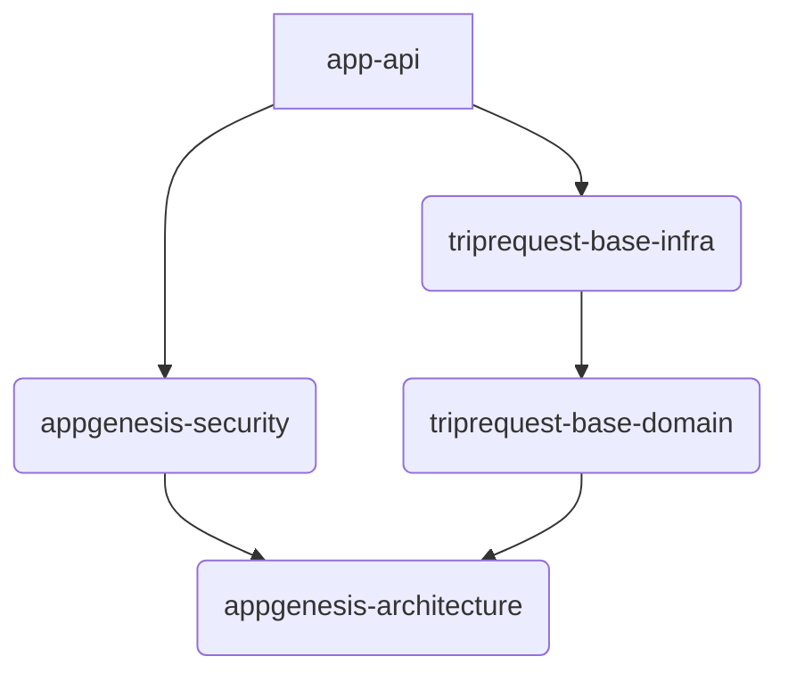

# AppGenesis

## Visão Geral do Projeto

O `AppGenesis` é uma aplicação modular desenvolvida em Java com Spring Boot, seguindo princípios de Clean Architecture e Domain-Driven Design (DDD). O objetivo principal é fornecer uma base robusta e escalável para o desenvolvimento de sistemas, com foco em segurança, reusabilidade e manutenibilidade.

A arquitetura é dividida em módulos bem definos, que separam as preocupações de domínio, infraestrutura, segurança e API, permitindo um desenvolvimento desacoplado e facilitando a evolução do sistema.

## Arquitetura

O projeto adota uma arquitetura modular, dividida em módulos principais, que seguem uma abordagem de arquitetura em camadas ou hexagonal, com o domínio centralizado e adaptadores para infraestrutura e interface.



### Módulos Principais e Responsabilidades:

*   **`app-api`**:
    *   Ponto de entrada da aplicação, configurando o ambiente Spring Boot.
    *   Expõe as APIs REST.
    *   Gerencia a inicialização do Spring Boot, configurações de banco de dados (PostgreSQL), e documentação OpenAPI (Swagger).
    *   Contém um `GlobalExceptionHandler` para padronizar as respostas de erro.

*   **`appgenesis-architecture`**:
    *   Contém componentes genéricos e abstratos que definem a arquitetura base e padrões reutilizáveis em todo o projeto.
    *   Define interfaces e classes base para serviços CRUD (`GenericServicePort`, `GenericCrudService`), validação de domínio, e mecanismos de auditoria (`AuditableInitializer`).
    *   Inclui `PermissionGuard` para verificação de permissões, desacoplando a lógica de segurança específica do domínio.
    *   Contém serviços de suporte como `FieldMergeService` para operações de PATCH/PUT.

*   **`appgenesis-security`**:
    *   Responsável por toda a lógica de autenticação, autorização e gerenciamento de usuários e permissões.
    *   Implementa autenticação baseada em JWT (`JwtAuthenticationFilter`, `TokenProviderPort`) e um sistema de permissões detalhado.
    *   Contém a lógica de negócio (`UserService`) e adaptadores de persistência para entidades de segurança (Usuários, Departamentos, Grupos, Permissões).
    *   Utiliza `WebSecurityConfig` para configurar o Spring Security, definindo políticas de acesso e tratamento de exceções de segurança.

*   **`triprequest-base-domain`**:
    *   Módulo de domínio de negócio específico, contendo a lógica para entidades de negócio (ex: `TripCategory`).
    *   Contém a implementação de domínios específicos, como `TripCategory`.
    *   `TripCategoryService` estende `GenericCrudService` e adiciona regras de negócio e permissões específicas para categorias de viagem.

*   **`triprequest-base-infra`**:
    *   Módulo de infraestrutura específico para o domínio `triprequest-base`.
    *   `TripCategoryRepositoryAdapter` e `TripCategoryEntity` gerenciam a persistência de dados para o domínio `TripCategory` usando JPA.
    *   `TripCategoryController` expõe endpoints RESTful para o domínio `TripCategory`, utilizando DTOs e mappers.

## Tecnologias Utilizadas

*   **Java 17**: Linguagem de programação principal.
*   **Spring Boot 3.3.4**: Framework para construção de aplicações robustas e escaláveis.
*   **Spring Data JPA / Hibernate**: Para persistência de dados e mapeamento objeto-relacional.
*   **PostgreSQL**: Banco de dados relacional.
*   **JWT (JSON Web Tokens)**: Para autenticação e autorização.
*   **Lombok**: Para reduzir boilerplate code.
*   **Swagger/OpenAPI**: Para documentação e teste de APIs.
*   **MapStruct**: Para mapeamento de objetos (DTOs para entidades e vice-versa).

## Como Rodar o Projeto

### Pré-requisitos

*   Java Development Kit (JDK) 17 ou superior
*   Maven 3.6.3 ou superior
*   Docker e Docker Compose (para o banco de dados PostgreSQL)

### Passos para Configuração e Execução

1.  **Clone o Repositório**:
    ```bash
    git clone [URL_DO_REPOSITORIO]
    cd appgenesis_v12_base
    ```

2.  **Configurar o Banco de Dados (PostgreSQL com Docker Compose)**:
    Certifique-se de que o Docker esteja em execução. No diretório raiz do projeto, execute:
    ```bash
    docker-compose up -d
    ```
    Isso iniciará um contêiner PostgreSQL. As configurações de conexão estão em `app-api/src/main/resources/application.yml`.

3.  **Compilar e Instalar os Módulos Maven**:
    No diretório raiz do projeto, execute:
    ```bash
    mvn clean install
    ```
    Isso compilará todos os módulos e instalará as dependências.

4.  **Executar a Aplicação Spring Boot**:
    Navegue até o diretório do módulo `app-api` e execute a aplicação:
    ```bash
    cd app-api
    mvn spring-boot:run
    ```
    A aplicação estará disponível em `http://localhost:8080` (ou na porta configurada em `application.yml`).

## Documentação da API (Swagger/OpenAPI)

Após iniciar a aplicação, a documentação interativa da API estará disponível em:
`http://localhost:8080/swagger-ui.html`

## Pontos de Atenção e Próximos Passos

*   **Cobertura de Testes**: Implementar e expandir a cobertura de testes unitários e de integração para todos os módulos.
*   **Monitoramento e Logging**: Aprimorar o sistema de monitoramento e logging para facilitar a depuração e a observabilidade da aplicação em produção.
*   **Escalabilidade**: Avaliar e implementar estratégias de escalabilidade (horizontal/vertical) e ferramentas de orquestração (ex: Kubernetes) conforme a necessidade.
*   **Documentação de Domínio**: Expandir a documentação de casos de uso e domínios de negócio, seguindo o exemplo de `triprequest-base/roteiro-caso-de-uso.md`.
*   **Refatoração de Validações**: Revisar e refatorar as validações de criação e atualização de entidades, especialmente onde há `TODO`s no código (ex: `UserService`).
*   **Evolução do Domínio**: Expandir o módulo `triprequest-base` para incluir outros domínios de negócio relacionados a viagens, além de `TripCategory`.